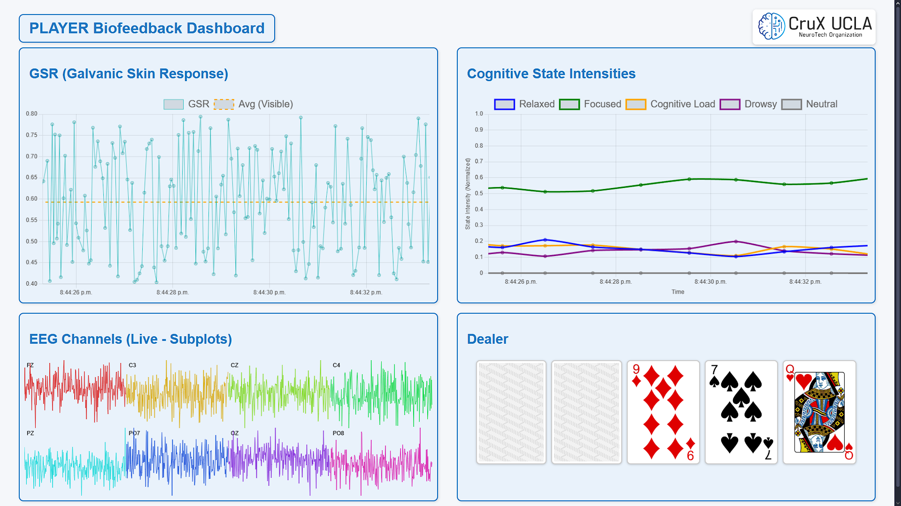

# BCIPOKER

BCI for AULI.TEC and Crux@UCLA's Poker Night

# Project Contributors 
Katie Callo
Vikram Ganesan
Abril Aguilar Lopez
Raymond Kallely
Simran Tawari
Natalie Sim
Umair Khan
Fulati Aizihaer
Joseph Dekel

# Project Description

### Summary: Real-Time Emotion Measurement Poker Tournament  

This project integrates brain computer interface technology into poker, using biometric data to analyze and visualize players' cognitive states during a game of poker.

### Objectives  
- Showcase Auli.tech, Cato, and CruX technologies.  
- Fundraise for ALS foundations and CruX initiatives.  
- Engage audiences through interactive gameplay and live data visualizations.  

### Timeline  
- Recruit team, secure venue.  
- Finalize designs, train emotion models, promote event.  
- Present demo at California Neurotech Conference in San Diego
- Host poker tournament at UCLA.  
- Display at Los Angeles Walk for ALS.  

This event blends entertainment and education, highlighting biometric tech while supporting meaningful causes.

# Data Pipeline

**Where do we get data, and what do we do with it?**


# Demo Display



# Credits 

- Fulati Aizihaer
- Katie Callo
- Joseph Dekel
- Abdallah Fares
- Omar Fayaz
- Vikram Ganesan
- Raymond Kallely
- Umair Khan
- Abril Aguilar Lopez
- Chrysa Prentza
- Natalie Sim
- Simran Tawari
- Alizee Wouters

--- 

Running Stress Detection Data Collection

```
conda activate cleanlsl
cd .\Stress-Detection\
python main.py --e
```