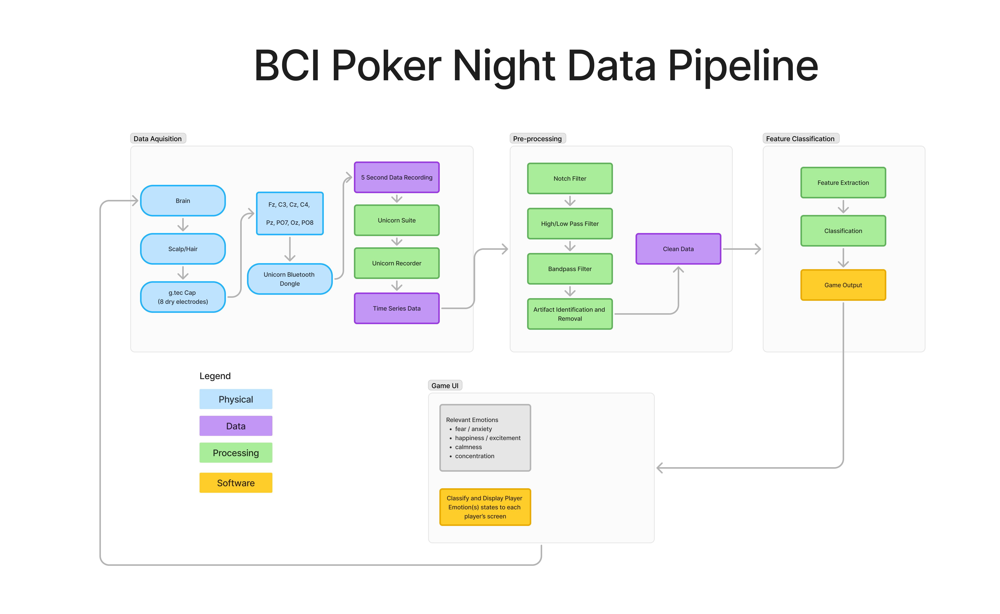

# BCIPOKER

BCI for AULI.TEC and Crux@UCLA's Poker Night

# Project Contributors 

Vikram Ganesan
Abril Aguilar Lopez
Raymond Kallely

# Project Description

### Summary: Real-Time Emotion Measurement Poker Tournament  

This project integrates brain computer interface technology into poker, using biometric data to analyze and visualize players' emotions and tells.

### Objectives  
- Showcase Auli.tech, Cato, and CruX technologies.  
- Fundraise for ALS foundations and CruX initiatives.  
- Engage audiences through interactive voting and live data visualizations.  

### Timeline  
- Recruit team, secure venue.  
- Finalize designs, train emotion models, promote event.  
- Host poker tournament at UCLA.  
- Display at Los Angeles Walk for ALS.  

This event blends entertainment and education, highlighting biometric tech while supporting meaningful causes.

# Data Pipeline

**Where do we get data, and what do we do with it?**

# Installation

WIP 

# Usage 

WIP

# Credits 

- Fulati Aizihaer
- Katie Callo
- Joseph Dekel
- Abdallah Fares
- Omar Fayaz
- Vikram Ganesan
- Umair Khan
- Abril Aguilar Lopez
- Chrysa Prentza
- Natalie Sim
- Simran Tawari
- Alizee Wouters 
