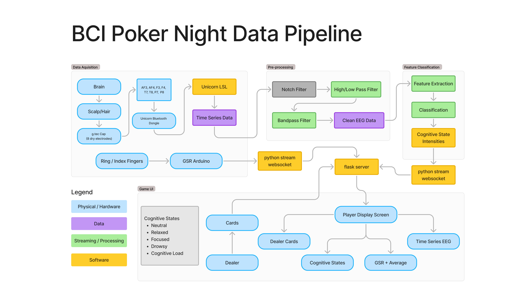

# BCIPOKER

BCI for AULI.TEC and Crux@UCLA's Poker Night

# Project Contributors 
Katie Callo
Vikram Ganesan
Abril Aguilar Lopez
Raymond Kallely
Simran Tawari
Natalie Sim
Umair Khan
Fulati Aizihaer
Joseph Dekel

# Project Description

### Summary: Real-Time Emotion Measurement Poker Tournament  

This project integrates brain computer interface technology into poker, using biometric data to analyze and visualize players' cognitive states during a game of poker.

### Objectives  
- Showcase Auli.tech, Cato, and CruX technologies.  
- Fundraise for ALS foundations and CruX initiatives.  
- Engage audiences through interactive gameplay and live data visualizations.  

### Timeline  
- Recruit team, secure venue.  
- Finalize designs, train emotion models, promote event.  
- Present demo at California Neurotech Conference in San Diego
- Host poker tournament at UCLA.  
- Display at Los Angeles Walk for ALS.  

This event blends entertainment and education, highlighting biometric tech while supporting meaningful causes.

# Data Pipeline

**Where do we get data, and what do we do with it?**



# Electrode Placement


# Showcase Display 


# Demo Display


# Usage

## Server Display (Showcase)

```bash
# in the ./Stress-Detection directoty
python main.py --s
```

## Server Display (DEMO)

```bash
# in the ./server-display directory
python app.py
```

## Stress Detection

This script serves as the main entry point for running the EEG experiment pipeline, including data collection, preprocessing, and future model training.

```bash
python main.py [--e | --p PID | --m <PID | all> | --s]
```

Flags

### `--e`

Runs the live EEG experiment, including:
- Participant ID prompt
- Real-time EEG recording (mock or real LSL stream)
- MIST task (math stressor)
- SPSL (subjective stress rating) prompts
- Saves:
    - eeg_raw.csv
    - spsl_responses.csv
    - phase_timestamps.json

Data Collection Guidlines

1. Run the main script with the experiment flag:
```
python main.py --e
```

2. Enter Participant ID

This is the ID used when processing data sets or training individual models. Choose a unique id, no enforced format. Then hit enter
```
Participant ID: <enter-id-here>
```

3. Enter rest state 1

The first rest state is 2 minutes, at the end you will be promted for your stress level.

4. Enter Mist Test

- Phase 1: easy difficulty, 120 seconds, ends with a stress level prompt
- Phase 2: medium difficulty, 120 seconds, ends with a stress level prompt
- Phase 3: hard difficulty, 120 seconds, ends with a stress level prompt

5. Final Rest State

The final rest helps capture "winding down"
- Phase 1: right after the end of mist phase 3, begin to "wind down"
- Phase : more rest, more relaxed

After this rest phase, one last stress prompt appears and data collection ends.

### `--p`
Processes data for a given participant:
- Loads eeg_raw.csv and spsl_responses.csv
- Applies preprocessing (notch filter, bandpass, artifact rejection)
- Epochs into 2s segments
- Extracts bandpower features (delta–gamma)
- Interpolates SPSL ratings to match features
- Aligns and saves to processed_data.csv


```bash
python main.py --p PID 
```

Replace PID with the chose ID for the session data set you want to process. This will store a csv of the data in the same directory where the raw data is store: `/.Stress-Detection/data/PID/processed_data.csv`

### `--m PID` or `--m all`
Trains a machine learning model using processed EEG features and interpolated stress labels.

```
python main.py --m PID
```

- Loads a 'processed_data.csv' for the specified participant
- Trains a Random Forest Regressor to predict continuous stress levels
- Output model performance $(R^2)$ and MSE
- Saves Model to: `data/<PID>/stress_model.pkl`

To train on all session data at once:

```
python main.py --m all
```

- Aggregates all processed_data.csv files under /data/*/
- Trains a unified model (stress_model_all.pkl)
- Used automatically in the live server for real-time stress prediction

### `--s` 

Runs the real-time server display dashboard, including:
- starting the flask + socketIO server
- streams EEG and GSR data
- generated predictions for 
    - stress detection
    - lie detection
- displays all signals and predictions in the interactive GUI

## Implementation Details

For the live server gui, data streams are updated at different time points for efficient CPU load. Below is a summary of their update intervals and where they can be altered / toggled.

| Feature       | Update Rate     | Where to Toggle                      |
| ------------- | --------------- | ------------------------------------ |
| EEG raw data  | \~250Hz         | `stream_real_eeg()` — emit line      |
| Bandpower     | Every 1s        | `if buffer_index >= ...` block       |
| Stress model  | Every 3s        | `predict_from_window()` call         |
| Lie detection | Every 3s (mock) | Same as stress block                 |
| GSR (Mock)    | Every 0.02s     | `stream_mock_gsr()` → `time.sleep()` |
| GSR (Real)    | Every 0.1s      | `stream_real_gsr()` → `time.sleep()` |

Model Prediction and Real-Time Buffering

- The EEG stream is buffered over a 2-second rolling window (500 samples @ 250Hz).
- Buffer is updated via np.roll() to shift in new samples in real time.
- Once full, the buffer is passed to the model via:

```
predict_from_window(eeg_buffer, config, model_path)
```

- The model applies the same filtering and feature extraction used during training (bandpass, notch, bandpower).
- Prediction is a continuous stress level value (e.g. 2.13), which is sent to the dashboard and plotted.

# Installation Guide

Install & Run Instructions / Guide

1. Download the BCIPoker gitub repo  
   1. [https://github.com/KatieCallo2026/BCIPoker](https://github.com/KatieCallo2026/BCIPoker)  
2. Install miniconda  
3. Setup python environment  
   1. Download miniconda  
   2. Open the miniconda prompt (shortcut or create from miniconda3/Scripts/activate  
      1. %windir%\\System32\\cmd.exe /K "C:\\Users\\\<YourUsername\>\\miniconda3\\Scripts\\activate.bat"  
   3. cd into BCIPoker repo  
   4. Create the poker environment: conda create \-n poker python=3.11 \-y  
   5. Activate the new env: conda activate poker  
   6. Install required packages: conda env update \--file environment.yml \--prune  
   7. run: pip install pyserial && pip install tqdm
4. Download the Stress Detection Model
    1. On the consulting team Google Drive
    2. Drop into folder: /BCIPoker/Stress-Detection/data/
6. Run Test Server  
   1. run: cd Stress-Detection   
   2. run: python [main.py](http://main.py) \--s  
   3. Open the http link it outputs to view dashboard  
7. Run with real EEG  
   1. Edit the config file and set \`mock-eeg\` to false  
   2. Pair the headset to the laptop via bluetooth  
   3. Open Unicorn LSL and open the stream and click start as well  
   4. Then run the server again, refresh as needed  
8. Run with real GSR data  
   1. Update the /Stress-Detection/gsr/hotspot\_gsr.ino sketch file with:  
      1. The name and password for the hotspot  
      2. The ip of the laptop connected to that hotspot  
      3. The ip is retrieved from running \`ipconfig\` in the terminal and it should be the IPv4 address under Wireless LAN adapter WiFi  
      4. Upload the sketch with the arduino connected to power supply and it will try to connect and send signals  
      5. Note: it can disconnect, just press the restart button to try to connect again, and this won't require you to upload the sketch   
   2. Make sure the laptop is connected to the hotspot  
   3. Make sure the hotspot is near both the laptop and arduino  
   4. Set \`mock-gsr\` to false in the config file  
   5. Run the server   
      1. Note, the arduino’s connection may time out, just hit the reset button to try to connect again, then you should see its http responses

Other things that are *very* useful:
* Git  
* Vscode

# Credits 

- Fulati Aizihaer
- Katie Callo
- Joseph Dekel
- Abdallah Fares
- Omar Fayaz
- Vikram Ganesan
- Raymond Kallely
- Umair Khan
- Abril Aguilar Lopez
- Chrysa Prentza
- Natalie Sim
- Simran Tawari
- Alizee Wouters

(names listed in alphabetical order by last name)
